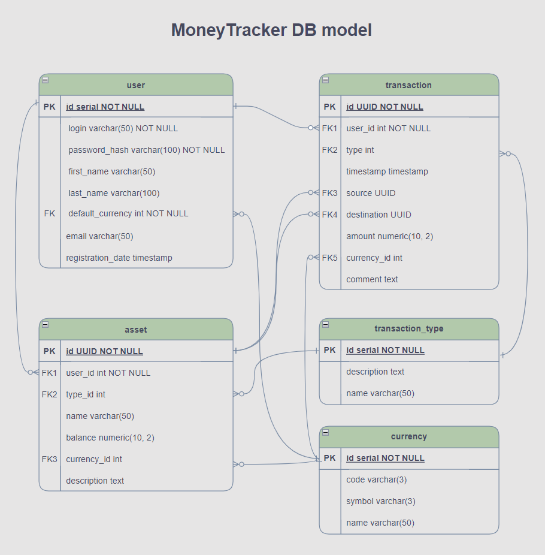

# MoneyTrackerBeta

## Description
MoneyTrackerBeta is a web-based application designed to help users manage their personal finances. It allows users to track income, expenses, and overall budget, providing a clear view of their financial health.

## Features
- User account creation and management
- Income and expense tracking
- Category-based transaction organization
- Budget setting and monitoring
- Financial reports and visualizations
- Secure data storage and handling

## Technology Stack
- Java 17 (Backend)
- Apache Tomcat 10.1.30 (Web Server)
- JDBC for database connectivity
- Custom connection pooling for efficient database operations

## Installation
1. Ensure you have Java JDK 17 installed (Amazon Corretto 17 recommended)
2. Download and install Apache Tomcat 10.1.30
3. Clone the repository: `git clone git@github.com:eugene-chekan/moneyTrackerBeta.git`
4. Deploy the application to Tomcat's webapps directory

## Configuration
1. Navigate to `src/main/resources`
2. Create a `config.properties` file with the following content:
3. Adjust the database URL, username, and password as per your setup

## Usage
1. Start the Tomcat server
2. Access the application at `http://localhost:8080/moneyTrackerBeta`
3. Create an account or log in
4. Start tracking your finances!

## Development
- The application uses a custom connection pool for database operations
- Main application logic is located in `src/main/java/lt/ehu/student/moneytrackerbeta`
- Web resources are in `src/main/webapp`

## Contributing
We welcome contributions! Please follow these steps:
1. Fork the repository
2. Create a new branch for your feature
3. Commit your changes
4. Push to the branch
5. Create a new Pull Request

## License
This project is licensed under the MIT License - see the LICENSE.md file for details

## Contact
For any queries or support, please contact:
Email: support@moneytrackerbeta.com

